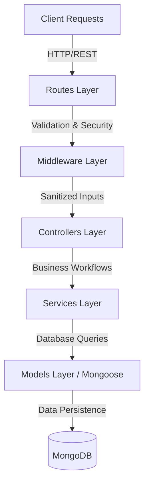

# Design Documentation — Adaptive E-Commerce Cart Engine

---

## Architecture Overview

The system uses a strict Model-View-Controller (MVC) architectural pattern:



### Layer Rationale

1. **Routes Layer (`src/routes/*`)**: Acts as the entry point, mounting specific endpoint paths and applying validators and security middleware.
2. **Middleware Layer (`src/middleware/*` & `src/validators/*`)**: Performs input sanitization, rate limiting, request validation (`express-validator`), and authentication verification.
3. **Controllers Layer (`src/controllers/*`)**: Coordinates flow between HTTP parameters and services, formatting and sending standard API responses. It does not contain business logic or database queries.
4. **Services Layer (`src/services/*`)**: Contains all business workflows (such as checking stock, compiling price summaries, and processing checkouts). This layer is database-aware but independent of Express `req`/`res` objects, making it highly testable.
5. **Models Layer (`src/models/*`)**: Defines schema schemas, structures, validation constraints, and database indexes.
6. **Centralized Configurations & Utilities (`src/config/*` & `src/utils/*`)**: Manages environment validation, database connections, and custom error wrappers (`ApiError`).

This separation provides modular code, keeps services testable in isolation, and keeps controllers focused on HTTP lifecycle concerns.

---

## Schema Design Decisions

### 1. Embedded Subdocuments for Cart Items
Cart items are stored directly inside the parent Cart document as an array of embedded subdocuments (`CartItemSchema` with `_id: true`) rather than a separate `CartItem` collection.

- **Atomicity and Speed**: Operations on the cart (like reading items, updating quantities, or clearing all items) are executed in a single MongoDB query. This avoids the cost of database joins or multiple round trips.
- **Avoiding N+1 Queries**: Fetching the cart retrieves all items and their snapshot data in one round-trip, preventing N+1 lookup patterns during checkout calculation.
- **Tradeoff**: MongoDB has a 16MB document size limit. At shopping cart scales (rarely exceeding 100 distinct items), a cart document is only a few kilobytes. A separate collection would be preferable only if items needed to be queried, reported, or aggregated independently across thousands of distinct carts at scale. That requirement is out of scope here.

### 2. Snapshotted Pricing and Metadata
When an item is added to the cart, the system retrieves its current `price`, `name`, and `category` from the product catalog and embeds them directly into the cart subdocument.

- **Price Stability**: This snapshots the price at the time of ingestion, protecting the customer's active session from mid-session price fluctuations.
- **Business Verification Rule**: During checkout confirmation, the system re-validates item availability and active status in the database (ensuring deactivated or out-of-stock items cannot be purchased), but respects the snapshotted price.

### 3. One-Cart-Per-User Invariant
Enforced via a unique index on `Cart.userId` (`CartSchema.index({ userId: 1, status: 1 }, { unique: true, partialFilterExpression: { status: 'active' } })` or simply unique on active carts).
This ensures a user has at most one active cart at any given moment. In our implementation, a unique index on `userId` (where status is managed) serves as a data-integrity check and security boundary, preventing IDOR attacks since users cannot access or overwrite other users' carts.

---

## Validation Strategy

Input validation uses a two-tier defense-in-depth model:

```
[Request] ---> [express-validator (Routes)] ---> [Mongoose Schema Constraints (DB)] ---> [Database]
```

1. **Primary Gate (Route-Level Validation)**:
   - Written using `express-validator` chains (e.g. `cart.validator.js`, `auth.validator.js`).
   - Validates correct data types, verifies strings are non-empty, checks for valid MongoDB ObjectIds, and restricts quantities to integers between `1` and `100`.
   - Handled by `validateRequest.middleware.js` to return a `400 Bad Request` containing a list of validation errors.
2. **Defense-in-Depth (Database-Level Constraints)**:
   - Enforced by Mongoose schema declarations (e.g. `min: 0` for price/stock, `lowercase: true` for emails, `required: true`).
   - Ensures data integrity even if route-level validation is bypassed.

---

## Security Strategy

1. **Helmet**: Applied globally to configure secure HTTP headers (such as `X-Content-Type-Options: nosniff` and `X-Frame-Options: SAMEORIGIN`) to mitigate cross-site scripting and clickjacking.
2. **CORS (Cross-Origin Resource Sharing)**: Strictly restricted using `process.env.CORS_ORIGIN`. A wildcard (`*`) is rejected in production to prevent unauthorized cross-origin resource requests.
3. **Rate Limiting**:
   - `globalLimiter`: Applied globally to all `/api/v1` routes to prevent denial-of-service (DoS) attacks.
   - `authLimiter`: A stricter rate limiter stacked on `/auth/register` and `/auth/login` to mitigate brute-force and credential stuffing attacks.
4. **Password Hashing**: Uses `bcrypt` with a salt cost factor of 10 to hash passwords before database storage.
5. **Secret Protection**: All credentials (like `JWT_SECRET` and `MONGO_URI`) are loaded from environment variables and validated at startup.
6. **Tenant Isolation**: Every database read and write query in the cart and checkout services uses the verified `userId` extracted from the JWT signature by `authMiddleware`. Client inputs cannot override the owner of the cart.

---

## Edge Cases Considered

The system handles these edge cases:

| Edge Case Scenario | Expected Behavior | Implementation Location |
| :--- | :--- | :--- |
| **Adding a duplicate product** | Increments the existing item's quantity rather than appending a new row. | `cart.service.js` (`addItemToCart`) |
| **Insufficient stock on add/update** | Rejects the request with a `400` error, returning available vs requested details. | `product.service.js` (`assertSufficientStock`) |
| **Product deactivated mid-session** | Checkout summary partitions it into `unavailableItems`; if no active items remain, checkout returns `EMPTY_CART`. | `checkout.service.js` (`buildCheckoutSummary`) |
| **Empty cart checkout** | Rejects the checkout confirmation request with a `400` error and the code `EMPTY_CART`. | `checkout.service.js` (`confirmCheckout`) |
| **Concurrent update handling** | Uses Mongoose's document save mechanics to prevent inconsistent array states. | `cart.service.js` |
| **Cart expires mid-session** | If the cart has expired and been deleted from the database, the next read operation transparently creates a new active cart. | `cart.service.js` (`getOrCreateCart`) |
| **Expired JWT token** | Intercepted by authentication middleware, returning a `410` status with the code `TOKEN_EXPIRED`. | `auth.middleware.js` |
| **Zero/negative/overflow quantity** | Route validators block non-integer values and values outside the `[1, 100]` range. | `cart.validator.js` |
| **Removing last item from cart** | Retains the active parent cart document with an empty `items` array rather than deleting it. | `cart.service.js` (`removeItem`) |
| **Diversity discount gaming** | Acknowledged limitation: A user could add cheap items in different categories to artificially inflate their diversity bonus. | `pricing.service.js` (Accepted design tradeoff) |

---

## Architectural Tradeoffs

### 1. Embedded Items vs. Referenced Collections
- **Tradeoff**: Embedding items in the `Cart` document prevents independent cross-cart reporting and can hit MongoDB's 16MB document limit.
- **Decision**: Embedded. Carts are accessed by a single user at a time, making document size negligible. Avoiding multiple round-trips and join operations outweighs the reporting limitation.

### 2. Snapshotted Pricing vs. Live Pricing
- **Tradeoff**: Snapshotting prices in the cart item can result in price discrepancies if catalog updates occur before checkout.
- **Decision**: Snapshotted. Securing the price at the time of insertion prevents sudden mid-session price changes for the user. We validate product availability at checkout, but respect the snapshotted price.

### 3. Stateless JWT vs. Database-Backed Sessions
- **Tradeoff**: Revoking compromised tokens is difficult before their expiration time without maintaining a token blacklist.
- **Decision**: Stateless JWT. This avoids session lookups on every request, improving performance and horizontal scalability. Token lifespans are kept short, and user authorization claims are self-contained.

### 4. Single Cart vs. Multiple Carts
- **Tradeoff**: Users cannot save items in multiple list-like structures.
- **Decision**: Single Cart. Enforces the invariant of one active cart per user, simplifying inventory management and reducing the risk of IDOR vulnerabilities.
